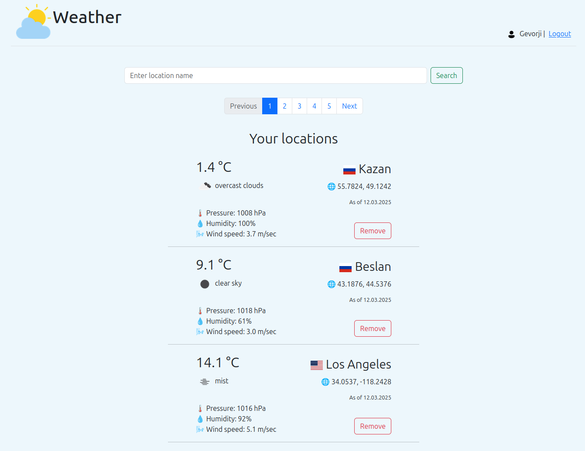

#  Приложение "Текущая погода"
Приложение реализовано согласно [ТЗ](https://zhukovsd.github.io/python-backend-learning-course/projects/weather-viewer/) 
в рамках роудмапа [Сергея Жукова](t.me/zhukovsd_it_mentor).

## Функционал
Веб-приложение позволяет:
- Создать собственный аккаунт
- Искать нужные локации
- Добавлять локации к себе в коллекцию - количество локаций не ограничено 
- Просматривать собственную коллекцию локаций с отображением текущей погоды 
(температура, скорость ветра, давление, влажность)

Для взаимодействия с приложением пользователь должен быть авторизован.

## Технологии 

- **Веб-фреймворк**: Django
- **Авторизация/регистрация пользователей**: django.contrib.auth
- **Работа с сессиями**: django.contrib.sessions
- **Логирование внутри приложения**: logging из стандартной библиотеки python
- **База данных**: PostgreSQL + Django ORM
- **Управление зависимостями, пакетный менеджер**: Poetry 
- **Юнит-тесты**: unittest из стандартной библиотеки python + django.test
- **Контейнеризация приложения**: Docker
- **Хост, деплой**: Ubuntu + Nginx (прокси-сервер) + gunicorn (сервер приложения) 

<h3 style="text-align: center">Общая схема архитектуры проекта</h3>

## Деплой и запуск
Указания по настройке и запуску проекта [приведены отдельно](docs/DEPLOYMENT.md).
